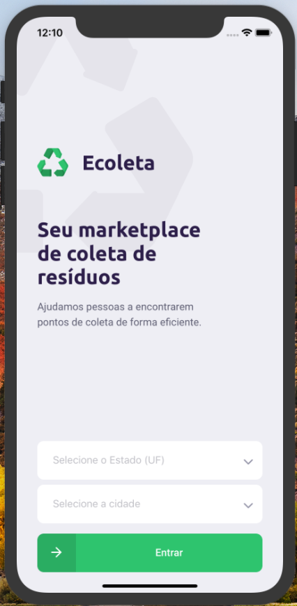
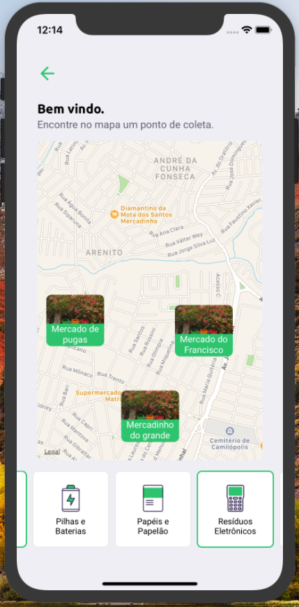
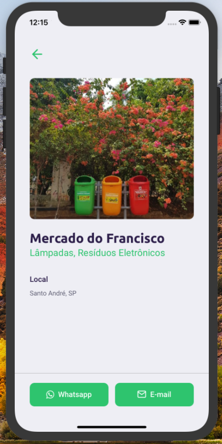
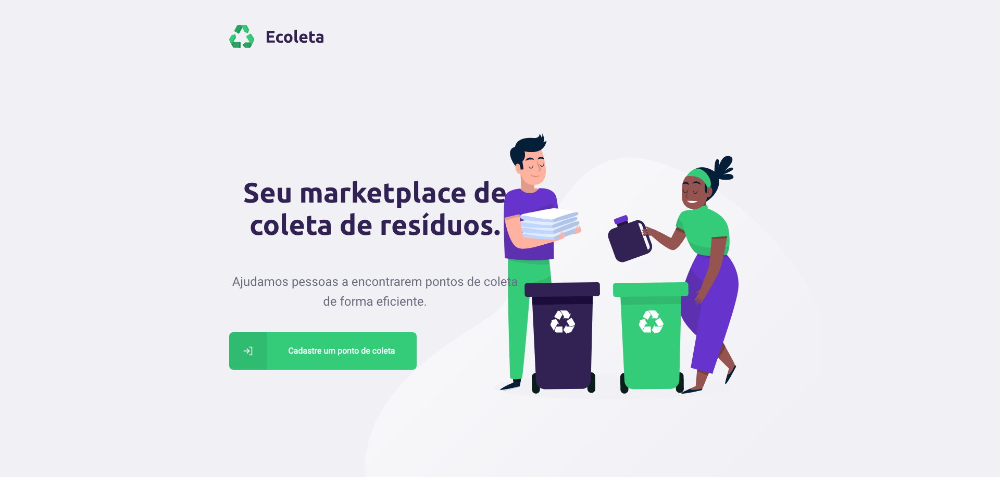
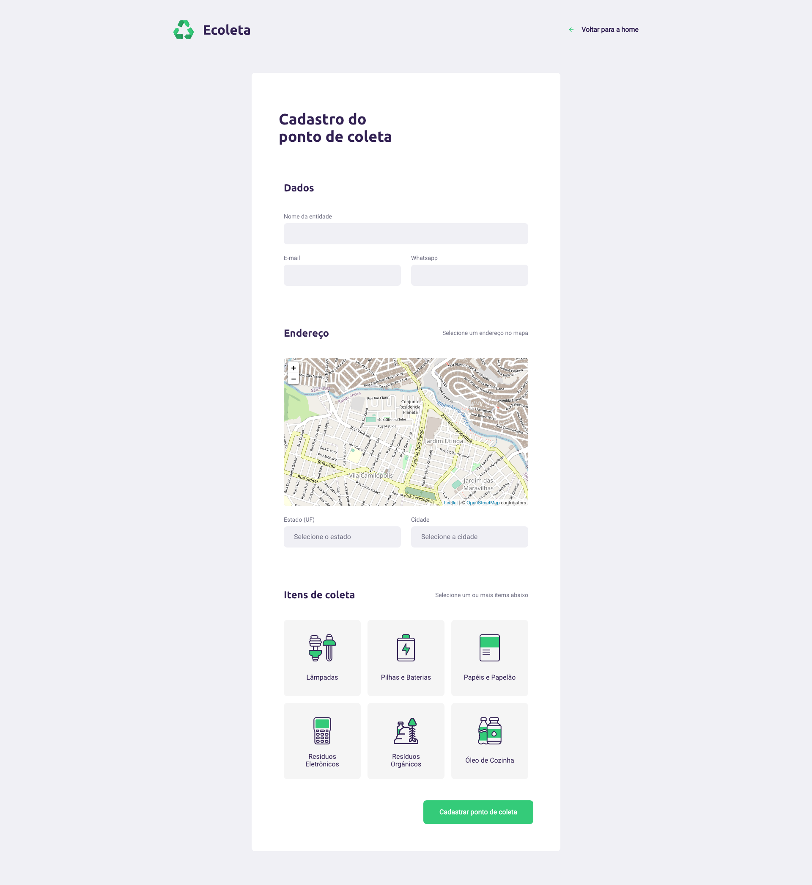

# 🚀 Next Level Week (RocketSeat)

- [x] Dia 1 - Conceitos e bootstrap dos projetos
- [x] Dia 2 - Backend com NodeJS
- [x] Dia 3 - Frontend Web com ReactJS
- [x] Dia 4 - App Mobile com React Native + Expo
- [ ] Dia 5 - Milha extra

# ♻️ EColeta 

Aplicativo para cadastro de pontos de coleta de produtos e resíduos recicláveis. 
- API construída em NodeJS servindo ao app mobile e o frontend web
- Frontend web construído com ReactJS para cadastro dos pontos de coleta
- App mobile construído com React Native para pesquisa dos pontos de coleta, informações e contato.

# 📷 Preview

## 📱 Mobile

  
  
  

## 💻 Web

